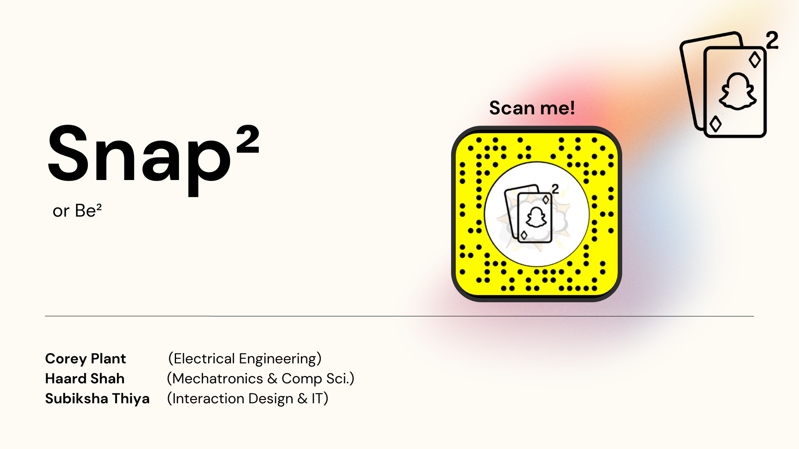
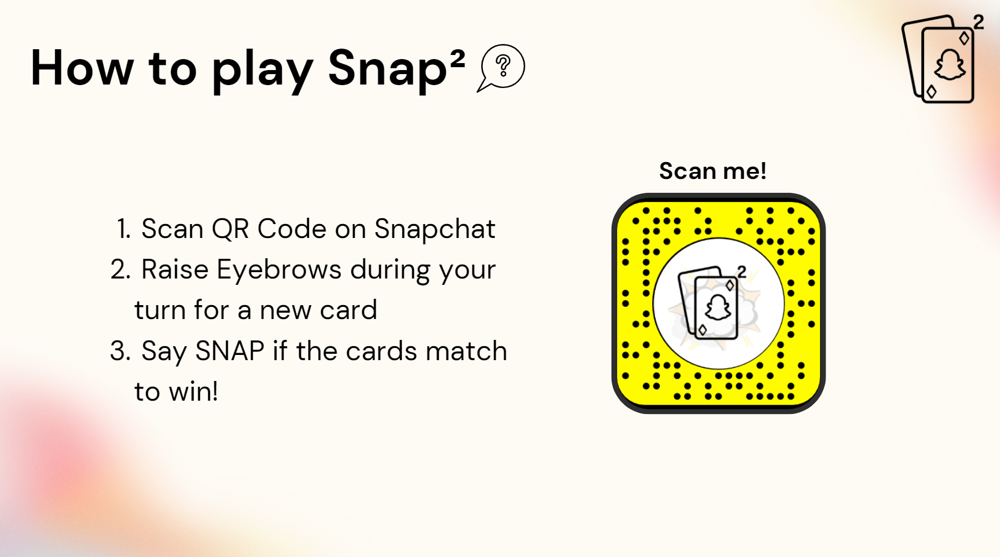

  

<h1 align="center">Snap²</h3>

   
   
  
  
  

---

 An Augmented Realtiy game of Snap built using Snap AR Toolkit. The application uses AR toolkit to track player faces and facial expression detection to draw a new card and play the snap game.
      

## 📝 Table of Contents
- [Getting Started](#getting_started)
- [Problem Statement](#problem_statement)
- [Idea / Solution](#idea)
- [Dependencies / Limitations](#limitations)
- [Future Scope](#future_scope)
- [Authors](#authors)
- [Acknowledgments](#acknowledgments)

## 🏁 Getting Started 
These instructions will get you a copy of the Snap² lens in your snapchat app.

To download the Snap² lens:

1. Open your snapchat app.
2. Open the snapchat qr code reader or your camera within the snapchat app.
3. scan the Snap² lens qr code.
4. Enjoy the game.

  

#### Game Instructions
`new card` Raise your eyebrows to gain a new card.

`snap` Say snap when both dealt cards are the same to earn a point. 

`winner` First player to 3 points wins the game. 

## 🧐 Problem Statement 
Snap a card game designed to test players attention and reaction speed. Our aim with this project was to replicate the same snap card game experience but on modern social media platforms; specifically snapchat.  

## 💡 Idea / Solution 
Snap is a two player game where cards are dealt to each player from two seperate decks and are played into a common pile at the same time. The players have the time between current pair and the next dealt pair to say Snap to claim all the cards dealt into deck collection.

To replicate the same experience in Sanpchat, we used the Snap AR toolkit to detect two player's and to deal augmented cards to each player. We use a eyebrow's raised trigger event to deal cards and a snap keyword to detect which player was the quickest to detect the common pair of cards.

## ⛓️ Dependencies / Limitations 
The application relies on the snapchat application as its a addon to the application. Snapchat can be downloaded from [Snapchat Download](https://www.snapchat.com/download?lang=en-US)

## 🚀 Future Scope 
Currently we are detecting the "snap" keyword using a open mount detection event but in the future we would like to replace this with a ML component which detect the "snap" keyword through phone's microphone.

## ⛏️ Built With 
- [Snap AR](https://ar.snap.com/en-US) - Augmented Reality Toolkit for Snapchat app

## ✍️ Authors 
- [@CPlant1](hhttps://github.com/CPlant1) - Idea & Initial work
- [@Subik5ha](https://github.com/Subik5ha) - Idea & Image assets
- [@Haard-Shah](https://github.com/Haard-Shah) - Development & Production

See also the list of [contributors](https://github.com/Haard-Shah/Snap_Squared/contributors) 
who participated in this project.

<!-- ## 🎉 Acknowledgments 
- Hat tip to anyone whose code was used
- Inspiration
- References -->